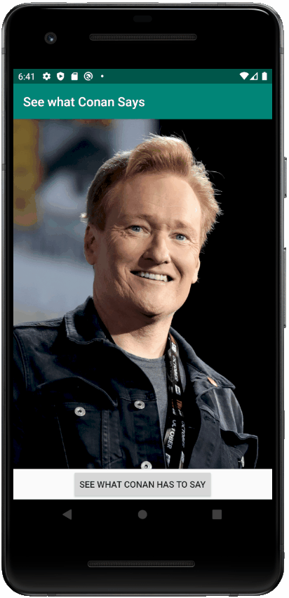

# Android Weekly Series

Welcome to the Android Weekly Series hosted by Google's Developer Student Club (DSC) program!

This is a ten week workshop series every Saturday, 1:30 - 3:30 EST from July 11, 2020 to Sept 12, 2020.

This series will cover all the essential skills needed to build professional, robust, and attractive Android apps.

Register now on EventBrite: [register.dsclsu.com/android](https://register.dsclsu.com/android)  
More info on: [www.dsclsu.com/android](https://www.dsclsu.com/android)

## 2. Favourite Celebrity App

Rohan: "Gosh, I would totally love it if Conan would say something to me. I love Conan!"

Have you ever felt like this too? Well may not be with Conan, but you might have felt this way about some other celebrity.
If so, good news! We're going to make an app that lets your favourite celebrity talk to you.

### Screenshots
 

 
 

### Skills Learned

1. Android layout
   1. ConstraintLayout
   2. ScaleType for images
   3. Width and Height: wrap_content and match_constraint
2. Android coding
   1. OnClickListeners
