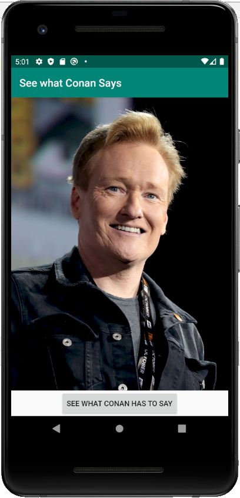

# Android Developer Essentials

Welcome to the Android Developer Essentials workshop series!
Here we will cover all the essential skills needed to build complex, robust, and attractive Android apps.

## 2. Favourite Celebrity App

Rohan: "Gosh, I would totally love it if Conan would say something to me. I love Conan!"

Have you ever felt like this too? Well may not be with Conan, but you might have felt this way about some other celebrity.
If so, good news! We're going to make an app that lets your favourite celebrity talk to you.

### Screenshots
 

 
 

### Skills Learned

1. Android layout
   1. ConstraintLayout
   2. ScaleType for images
   3. Width and Height: wrap_content and match_constraint
2. Android coding
   1. OnClickListeners
